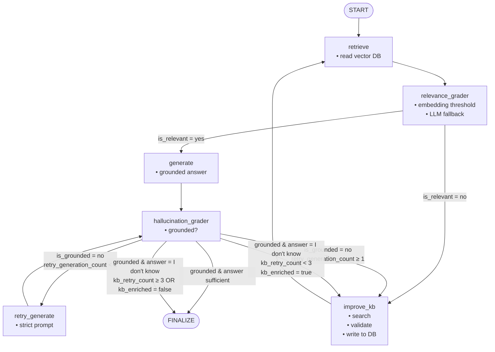

# Architecture – RAG Incident Assistant

## Objective

Build a **production-safe RAG system** for Spark / BFS incident analysis that:

- avoids hallucinations
- retries deterministically
- grows its knowledge base safely
- never stores model-generated content
- terminates predictably

---

## High-Level Flow

```text
START
  ↓
retrieve
  ↓
relevance_grader
  ↓
generate
  ↓
hallucination_grader
  ↓
┌───────────────┬────────────────┬───────────┐
│ retry_generate│ improve_kb     │ finalize  │
└───────────────┴────────────────┴───────────┘
````

---

## Graph State

```text
question
documents                 # append-only
generation

is_relevant
is_grounded

retry_generation_count     # max 1
kb_retry_count             # max 3
kb_enriched                # boolean

steps                      # append-only (observability)
```

---

## Node Responsibilities

### 1. retrieve

* Reads from **vector DB only**
* Returns candidate documents
* No filtering
* No writes

---

### 2. relevance_grader

**Hybrid relevance grading**

* Embedding similarity thresholds:

  * High → accept
  * Low → reject
  * Borderline → LLM fallback
* Liberal but firm:

  * Partial logs / configs → relevant
  * Different system / job → irrelevant

Outputs:

* filtered documents
* `is_relevant`

---

### 3. generate

* Uses **only filtered documents**
* Must refuse if context is insufficient:

```text
I don't know - The current knowledge base is insufficient to answer this.
```

* Never writes to vector DB

---

### 4. hallucination_grader

* Structured LLM output
* Zero tolerance:

  * Any unsupported claim → `is_grounded = "no"`
* Refusals are **not hallucinations**

---

### 5. retry_generate

* Triggered only when:

  ```text
  is_grounded == "no"
  ```
* Max retries: **1**
* Stricter prompt
* No retrieval
* No KB writes

---

### 6. improve_kb

Triggered only when:

* Answer is grounded
* Answer is `"I don't know"`

Responsibilities:

* Rewrite query
* Fetch **external source-of-truth documents**
* Validate sources
* Normalize
* Chunk
* Deduplicate
* Embed
* Upsert to vector DB

Sets:

```python
kb_enriched = stored_chunks > 0
```

Never generates answers.

---

## Routing Logic

```python
if is_grounded == "no":
    retry_generate (≤1)
    else improve_kb

elif generation == "I don't know":
    improve_kb if kb_retry_count < 3 and kb_enriched
    else finalize

else:
    finalize
```

---

## Vector DB Contract

### Allowed Content

* Logs
* Runbooks
* Official documentation
* API specifications
* External source-of-truth data

### Forbidden Content

* LLM-generated answers
* Summaries
* Reasoning traces
* Hypotheses

---

## Vector DB Write Rules

* Writes occur **only** in `improve_kb`
* Writes must be:

  * validated
  * deduplicated
  * idempotent
* Generation nodes **never write**

---

## Vector DB Write Pipeline

```text
external_docs
   ↓
source validation
   ↓
normalization + hashing
   ↓
chunking
   ↓
deduplication
   ↓
embedding
   ↓
upsert to Chroma
```

---

## Chroma Usage

* Persistent storage
* Single embedding model
* Separate module (`chroma_store.py`)
* Safe to import in notebooks and services

---

## Safety Guarantees

* No infinite loops
* No retry masking
* No self-reinforcing hallucinations
* Deterministic termination
* Bounded retries

---
Flow Chart


