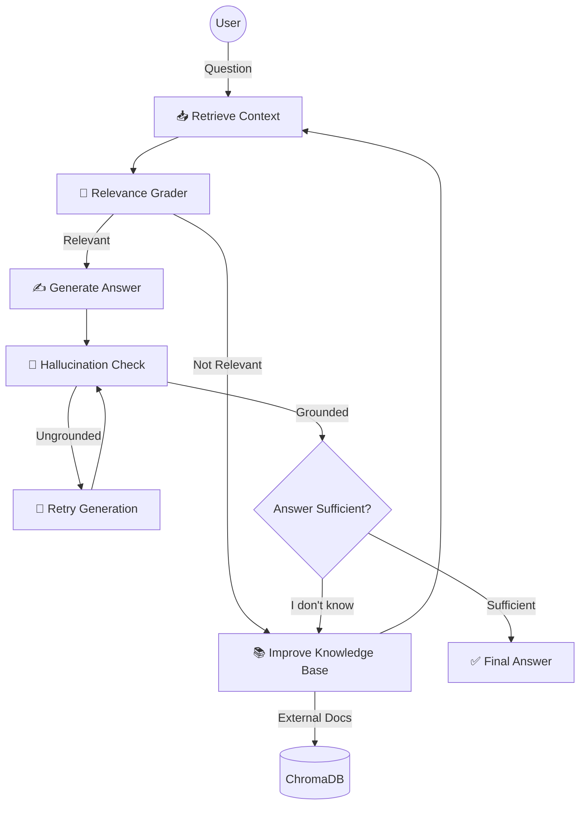

# 🏦 BFS Agentic Data Debugging Assistant

A **Self-Service Data Support Agent** designed for Banking & Financial Services (BFS).
This application uses **LangGraph**, **OpenAI**, **Chroma**, and **external search tools** to investigate data issues, debug failures, and provide **grounded, explainable Tier-1 support** to data users.

The system follows a **retrieval-first, safety-bounded design**:
it reasons only over **verified logs, documentation, and external sources**, and improves its knowledge base **only with externally sourced facts** — never with LLM-generated answers.

---

## 🏗️ Architecture

The system is implemented as a **Stateful LangGraph Workflow**, where each node has a single responsibility and the graph can **loop, retry, or enrich knowledge safely**.


```mermaid
graph TD
    User((User)) -->|Question| Retrieve[📥 Retrieve Context]
    Retrieve --> Relevance[🎯 Relevance Grader]

    Relevance -->|Relevant| Generate[✍️ Generate Answer]
    Relevance -->|Not Relevant| ImproveKB[📚 Improve Knowledge Base]

    Generate --> Hallucination[🧪 Hallucination Check]

    Hallucination -->|Ungrounded| Retry[🔁 Retry Generation]
    Hallucination -->|Grounded| Decision{Answer Sufficient?}

    Retry --> Hallucination

    Decision -->|I don't know| ImproveKB
    Decision -->|Sufficient| Final[✅ Final Answer]

    ImproveKB -->|External Docs| VectorDB[(ChromaDB)]
    ImproveKB --> Retrieve
```

**Key architectural principles:**

* Separation of **reasoning failures** vs **knowledge gaps**
* Bounded retries (no infinite loops)
* Vector DB stores **external evidence only**
* LLM answers are **never written back** into the KB

---

## 🚀 Key Features

### 1. Multi-Node Orchestration (LangGraph)

Instead of linear chains, the system uses a **stateful graph** that can:

* Retry generation when hallucinations are detected
* Enrich the knowledge base only when information is missing
* Terminate deterministically when no further progress is possible

Each node operates on a shared `GraphState`, making behavior **transparent and debuggable**.

---

### 2. Autonomous Debugging & Context Retrieval

The assistant retrieves:

* Logs
* Configuration snippets
* Documentation
* Runbooks
* External references (via Tavily)

All retrieved content is:

* Relevance-graded (hybrid embedding + LLM fallback)
* Passed to generation **only if trusted**

This ensures the LLM never answers from unrelated or low-quality context.

---

### 3. Controlled Knowledge Base Improvement (Safe RAG)

The system implements a **Read → Enrich → Re-Read** loop (not Read-Solve-Write).

**Important distinction from earlier versions:**

* The system **does NOT store LLM-generated fixes**
* Only **external documents** (logs, docs, search results) are written to Chroma

#### Improve KB Flow

1. Retrieve existing documents
2. If insufficient:

   * Rewrite query
   * Fetch external sources (Tavily)
3. Validate, chunk, deduplicate
4. Upsert into ChromaDB
5. Retry retrieval + generation

This avoids **self-reinforcing hallucinations** and keeps the KB trustworthy.

---

## 🔒 BFS Compliance & Guardrails

The design explicitly supports BFS-grade safety and auditability.

| Guardrail                  | Description                                                                                 |
| -------------------------- | ------------------------------------------------------------------------------------------- |
| **No Model Feedback Loop** | LLM-generated answers are never stored in the vector database.                              |
| **Grounding Enforcement**  | Answers must be fully supported by retrieved context or explicitly return `"I don't know"`. |
| **Bounded Retries**        | Retry-generation and KB enrichment loops are strictly capped.                               |
| **Source-Aware Storage**   | Only approved external sources are written to ChromaDB.                                     |
| **Observability**          | Every state transition is logged via `steps` for audit and debugging.                       |

This makes the system suitable for **regulated environments**.

---

## 🛠️ Tech Stack

* **Orchestration:** [LangGraph](https://langchain-ai.github.io/langgraph/)
* **LLM:** OpenAI GPT-4o (temperature 0)
* **Vector Store:** ChromaDB (persistent, local/server)
* **Search Enrichment:** Tavily Web Search
* **Embeddings:** OpenAI Embeddings
* **Environment Management:** `python-dotenv`
* **Development Interface:** Jupyter Notebooks (testing harness)

---

## 🧠 System Design (The Graph)

The entire workflow operates over a single shared state object.

### State Schema

```python
class GraphState(TypedDict):
    question: str
    documents: List[Document]

    generation: str
    is_relevant: str
    is_grounded: str

    retry_generation_count: int
    kb_retry_count: int
    kb_enriched: bool

    steps: List[str]
```

Each field has a **single semantic meaning**:

* `is_grounded` → hallucination signal
* `kb_enriched` → whether new factual knowledge was added
* Counters → enforce bounded execution

---

### The Knowledge Improvement Logic

The **Improve KB Node** is strictly controlled:

1. Triggered only when:

   * Answer is grounded but insufficient (`"I don't know"`)
2. Fetches **external sources only**
3. Writes **only validated, deduplicated chunks** to Chroma
4. Signals enrichment via `kb_enriched`
5. Stops early if no new knowledge can be added

This ensures the system improves **safely and incrementally**.

---

## ✅ Summary of Key Design Guarantees

* ❌ No hallucinated content stored
* ✅ Deterministic exits
* ✅ Clear separation of concerns
* ✅ Production-safe RAG loop
* ✅ BFS-appropriate guardrails

---

Just tell me what you want to optimize next 👍
