# 🏦 BFS Agentic Data Debugging Assistant

A **Self-Service Data Support Agent** designed for Banking & Financial Services (BFS). This application utilizes **LangGraph**, **OpenAI**, and **Airflow** to autonomously investigate data quality issues, debug pipeline failures, and provide "Tier 1" support to data users.

It features a **Self-Learning Knowledge Base** that captures tribal knowledge and automatically updates itself based on solved issues.

---

## 🏗️ Architecture

The system follows a **Hub-and-Spoke Agentic Architecture**. A central Supervisor (Router) interprets user intent and delegates tasks to specialized tools.

```mermaid
graph TD
    User((User)) -->|Query| Supervisor[🕵️ Supervisor Node]
    
    subgraph "Execution Zone"
        Supervisor -->|Data Quality?| SQL[🔍 SQL Investigator]
        Supervisor -->|Job Failed?| Airflow[⚙️ Airflow Inspector]
        Supervisor -->|How-To/Script Error?| KB[📚 Knowledge Manager]
    end
    
    subgraph "Learning Loop"
        KB -->|No Match?| LLM[🧠 Solver LLM]
        LLM -->|Generate Fix| Harvester[🚜 Harvester Node]
        Harvester -->|Upsert| VectorDB[(ChromaDB)]
    end
    
    SQL --> Supervisor
    Airflow --> Supervisor
    KB --> Supervisor
    Supervisor -->|Final Answer| User
```



---

## 🚀 Key Features

### 1. Multi-Agent Orchestration (LangGraph)
Unlike linear chains, this system uses a **Stateful Graph**. It can loop, retry, and maintain context across multiple steps (e.g., verifying data first, then checking logs if data is missing).

### 2. Autonomous Airflow Observability
The agent connects directly to the **Apache Airflow API** to:
* Check the status of specific DAGs.
* Fetch and parse logs for failed tasks.
* Identify specific error codes (e.g., `TimeOut`, `KeyError`) from massive log files.

### 3. Self-Improving Knowledge Base (RAG+)
Implements a **Read-Solve-Write** feedback loop:
1.  **Read:** Searches existing docs for script errors or onboarding issues.
2.  **Solve:** If no doc is found, it uses the LLM to generate a first-principles fix.
3.  **Write:** It automatically formats the fix and **saves it back to the Vector Database** for future retrieval.

---

## 🔒 BFS Compliance & Guardrails

Security is paramount. The following layers ensure this tool is safe for production banking environments:

| Guardrail | Description |
| :--- | :--- |
| **PII Air Gap** | **Input:** Regex scrubbers mask Account #s and SSNs before they reach the LLM.<br>**Output:** SQL results are scanned for PII before being returned to the chat context. |
| **Read-Only Access** | The SQL Agent uses a Service Account restricted to `SELECT` only. All DDL/DML (`DROP`, `INSERT`) permissions are revoked at the database level. |
| **Knowledge Quarantine** | Auto-generated knowledge entries are tagged as `verified: False`. The UI warns users when a solution is AI-generated and not human-reviewed. |
| **Schema Whitelisting** | The agent can only "see" approved Data Mart schemas, not the entire Raw Data Lake. |

---

## 🛠️ Tech Stack

* **Orchestration:** [LangGraph](https://langchain-ai.github.io/langgraph/)
* **LLM:** Azure OpenAI (GPT-4o) - *Deployed in Private VNET*
* **Vector Store:** ChromaDB (Local/Server)
* **Database Integration:** SQLAlchemy (Snowflake/Oracle/Postgres)
* **Observability:** Apache Airflow Client
* **Frontend:** Streamlit

---

## 🧠 System Design (The Graph)

The application logic is defined by the `AgentState` passed between nodes.

### State Schema
```python
class AgentState(TypedDict):
    messages: Annotated[List[BaseMessage], add_messages]
    user_intent: str             # 'LIVE_DEBUG', 'KNOWLEDGE_SEARCH', 'AIRFLOW_CHECK'
    sql_results: Optional[str]   # Result of SQL Query
    log_snippet: Optional[str]   # Result of Airflow Log Fetch
    retrieved_docs: List[Document]
    generated_solution: str      # The fix generated by LLM if Docs were empty
    ready_to_learn: bool         # Trigger for the Harvester Node
```

### The Learning Loop Logic
The **Harvester Node** ensures the system gets smarter over time without human intervention:

1.  **Ingest:** User asks about a specific shell script error (e.g., "Error 127").
2.  **Search:** Vector DB returns 0 results.
3.  **Reason:** LLM identifies "Error 127" as "Command not found/Path issue."
4.  **Harvest:** The system captures this Q&A pair.
5.  **Commit:** Saves to ChromaDB with metadata `{'source': 'auto-gen', 'verified': False}`.

---
