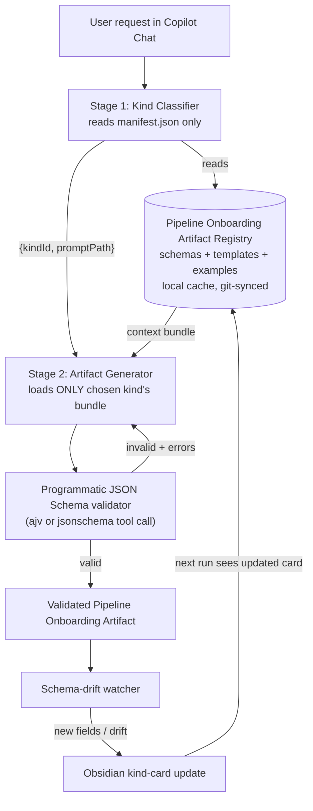

# Brief: Pipeline Onboarding Artifact System

You are operating inside our **GitHub Copilot Chat extension harness** with tool calling and enterprise data access (GitLab, Jira, Confluence). Your task is to design and implement a **Pipeline Onboarding Artifact Registry** and a **two-stage prompt router** so that:

1. Generation of Pipeline Onboarding Artifacts (JSON config files consumed by our Data Platform) never produces structurally invalid artifacts.
2. Generation latency drops materially below the current 5-7 minute baseline by ending the practice of re-reading every prompt markdown from git on every turn.

---

## Anti-hallucination guardrails (read first, obey throughout)

- **DO NOT invent file paths, repo names, artifact-kind names, schema field names, or prompt filenames.** Every identifier you use in code, docs, or examples MUST come from a file you have actually opened in this session, or from an answer the user has given you in this conversation.
- **DO NOT assume the number of artifact kinds.** The user mentioned "3-4 kinds of structures" — confirm the exact count and their canonical IDs by inspecting the prompts repo and the Obsidian vault during the Discovery Phase before proceeding.
- **DO NOT generate JSON Schemas from imagination.** Schemas are either (a) already checked into the repo (canonical, do not modify without a diff PR), or (b) derived by the bootstrap procedure in section "Schema bootstrap" using `genson` over real sample artifacts.
- **DO NOT skip the Discovery Phase.** If any required input from Discovery is missing or ambiguous, stop and ask the user. Do not guess.
- **DO NOT inline large content into instruction prompts.** Schemas, templates, and examples are loaded via the registry bundle, never copy-pasted into prompts.
- **All artifact validation is programmatic, not LLM-judged.** Use `ajv` (Node, JSON Schema Draft 2020-12) or `jsonschema` (Python) — pick one and stay consistent.

---

## Discovery Phase (must complete before writing any code or docs)

Produce a Discovery Report as your first deliverable. Use tool calls only — no guessing.

1. **Enumerate prompts.** List every file under the prompts directory of our Copilot Chat harness repo. For each prompt, capture: filename, size, last modified, the artifact kind it produces (read the file's frontmatter or first heading — do not infer from filename alone).
2. **Enumerate artifact kinds.** Open the Obsidian vault root. List existing pages that describe Pipeline Onboarding Artifact kinds. Cross-reference with the prompts to produce the canonical list of kinds. Output as a table: `kind_id | obsidian_page | prompt_file | has_json_schema (yes/no) | has_template (yes/no) | example_count`.
3. **Locate canonical JSON Schemas.** For each kind, search the repo for an existing JSON Schema file. If one exists, record its absolute path and JSON Schema draft version. If none exists, mark the kind for the bootstrap procedure.
4. **Locate templates.** For each kind, locate the template file the Data Platform expects (the structural skeleton with placeholders). Record its path.
5. **Collect example artifacts.** For each kind, find at least 5 (ideally 10-30) historical artifacts that the Data Platform accepted in production. These come from the onboarding history in GitLab MRs, the artifacts repo, or Confluence attachments. Record absolute paths or GitLab URLs.
6. **Measure current latency breakdown.** Run a single artifact generation end-to-end with timing instrumentation. Report: prompt-fetch time, context-load time, model inference time, tool-call time, validation time. This is the baseline we will compare against.

Stop after Discovery and present the report. Do not proceed until the user confirms the kind list is complete and correct.

---

## Target architecture



---

## Pipeline Onboarding Artifact Registry

### Layout

Created inside the prompts repo so a single `git pull` syncs prompts and registry together. Replace `<kind_id>` with the canonical IDs from the Discovery Report — never invent.

```
artifact-registry/
  manifest.json
  kinds/
    <kind_id>/
      schema.json
      template.json
      kind-card.md
      examples/
        <hash-or-name>.json
      changelog.md
  conventions/
    naming.md
    common-fields.md
```

### `manifest.json` schema (this file is the ONLY thing the classifier loads)

```json
{
  "$schema": "https://json-schema.org/draft/2020-12/schema",
  "version": "1.0.0",
  "kinds": [
    {
      "id": "<kind_id from Discovery>",
      "label": "<human-readable label from kind-card.md>",
      "whenToUse": "<one sentence selection rule>",
      "requiredInputs": ["<input name>", "..."],
      "promptPath": "prompts/<file>.md",
      "schemaPath": "artifact-registry/kinds/<kind_id>/schema.json",
      "templatePath": "artifact-registry/kinds/<kind_id>/template.json",
      "examplePaths": ["artifact-registry/kinds/<kind_id>/examples/<file>.json"]
    }
  ]
}
```

### `kind-card.md` shape (Obsidian-readable, the human face of the kind)

```markdown
---
kind_id: <kind_id>
schema: artifact-registry/kinds/<kind_id>/schema.json
template: artifact-registry/kinds/<kind_id>/template.json
last_reviewed: <YYYY-MM-DD>
---

# <Kind label>

## When to use
<one paragraph selection rule, written precisely enough that the classifier prompt can rely on it>

## Inputs required
- <input name>: <type, source, validation rule>

## Gotchas and notable variations
- <observed corpus variation, link to example artifact>

## Cross-field rules (beyond JSON Schema)
- <rule>

## Related Confluence / Jira
- <link>
```

The `kind-card.md` is the Obsidian-linkable index. `schema.json` is the machine contract. They cross-reference. If they drift, the schema-drift watcher reports it.

---

## Schema bootstrap (only for kinds Discovery flagged as `has_json_schema: no`)

Three deterministic passes. Do not improvise.

1. **Structural pass.** Run `genson` over 10-30 example artifacts of the same kind. Produces a draft JSON Schema with keys, types, nullability, and enum candidates.
2. **Enrichment pass.** One-shot LLM call with this exact instruction:
   > Given this draft JSON Schema and these N example artifacts, add `title`, `description`, sensible `required`, and `pattern` or `enum` constraints **only where the corpus is unanimously consistent**. Do not invent constraints that any example violates. Do not add fields that do not appear in any example. Output JSON Schema Draft 2020-12.
3. **Human review pass.** The user reviews and commits. From here on, the schema is the source of truth and is never regenerated — only diff-PR'd.

---

## Two-stage router

### Stage 1: Kind Classifier

A short tool-callable prompt. Input: user request text + `manifest.json` only. Output (JSON-only, no commentary):

```json
{
  "kindId": "<one of manifest.kinds[].id>",
  "promptPath": "<one of manifest.kinds[].promptPath>",
  "confidence": "high|medium|low",
  "reasoning": "<one sentence>"
}
```

If confidence is `low`, the harness asks the user to disambiguate before proceeding. The classifier must NOT pick a kind whose `id` is not in the manifest.

### Stage 2: Artifact Generator

After Stage 1 resolves `kindId`, call the `load_context_bundle(kindId)` tool. It returns:

```json
{
  "instructions": "<contents of promptPath, instructions only>",
  "schema": <parsed schema.json>,
  "template": <parsed template.json>,
  "examples": [<N curated good artifacts>],
  "kindCard": "<contents of kind-card.md>"
}
```

The generator prompt receives this bundle and produces the artifact JSON. Output is JSON-only.

---

## Hard validation gate (the reliability win)

Before the artifact is returned to the user, run these in order:

1. JSON parse.
2. `validate_artifact(kindId, artifact)` tool — programmatic JSON Schema validation against `schema.json`. Use `ajv` or `jsonschema`. Return a structured error list.
3. Cross-field rules from `kind-card.md` front-matter (machine-readable subset). Run each as a small predicate.

On failure: feed the structured errors back into the generator with the instruction "Fix only the listed errors. Do not modify any other fields." Retry up to 2 times. If still failing, return the partial artifact with the validation report — never silently return invalid output.

---

## Schema-drift watcher (the "ever-adapting" part)

After every successful generation:

1. Diff the new artifact's structure against `schema.json`.
2. If the artifact adds a field or refines an enum:
   - **One-off variation** (seen in only this artifact) — append a row under `kind-card.md` -> "Notable variations" with a link to the artifact.
   - **Recurring drift** (seen in 3+ recent artifacts) — open a GitLab MR titled `schema-update: <kind_id>` that updates `schema.json`, appends an entry to `changelog.md`, and lists the example artifacts that motivated the change. **Never auto-merge.**
3. Every accepted MR appends to `changelog.md`. This gives the registry an audit trail and prevents silent contract changes.

---

## Tools to register in the harness

Implement these as harness-level tools (not as inline LLM calls):

- `classify_artifact_request(userRequest: string) -> { kindId, promptPath, confidence, reasoning }`
- `load_context_bundle(kindId: string) -> { instructions, schema, template, examples, kindCard }`
- `validate_artifact(kindId: string, artifact: object) -> { valid: boolean, errors: ValidationError[] }`
- `propose_schema_update(kindId: string, artifact: object) -> { diff: JSONPatch[], rationale: string }`
- `refresh_prompts_cache() -> { changed: string[], pulled_at: ISO8601 }`

Pick **one** runtime — Node (with `ajv`) or Python (with `jsonschema` + `genson`) — and stay consistent across all five tools.

---

## Local prompt cache (the latency win)

Stop reading prompts from a remote on every turn.

- On harness session start, run `git pull` against the prompts repo into a local cache directory.
- All tool reads go to the local cache, never to remote.
- Cache entries carry a TTL (default 1 hour). Beyond TTL, the next read triggers a background `git pull` and serves the cached copy in the meantime.
- The `refresh_prompts_cache` tool forces a sync when the user knows there's a new prompt or schema.

---

## Deliverables

In order, do not skip:

1. **Discovery Report** (as defined above) — present and wait for user confirmation.
2. **Bootstrap branch** containing `artifact-registry/` skeleton, `manifest.json`, one fully-populated `<kind_id>/` (pilot kind chosen by the user), and the five harness tools.
3. **Pilot end-to-end test** — generate one Pipeline Onboarding Artifact for the pilot kind through the new router + validator path. Report: latency vs Discovery baseline, validation result, drift watcher output.
4. **Generalization PRs** — one MR per remaining kind that adds its `schema.json` (bootstrap if missing), `template.json`, `kind-card.md`, examples, and manifest entry.
5. **Prompt refactor MR** — split each existing artifact prompt into instructions-only; remove inlined schemas/templates/examples; point at registry bundle paths.

---

## Acceptance criteria

- [ ] Discovery Report lists every artifact kind, with every kind cross-referenced to a real Obsidian page, a real prompt file, and a real schema location (or marked for bootstrap).
- [ ] `manifest.json` validates against its own meta-schema and contains no kind ID not present in the Discovery Report.
- [ ] Every kind has a `schema.json` that validates a known-good corpus of >=5 historical artifacts.
- [ ] `validate_artifact` returns `{ valid: true }` on every artifact in `examples/` for its own kind.
- [ ] Pilot generation latency, measured the same way as the Discovery baseline, is at least 50% lower.
- [ ] No prompt markdown file is read from a remote during a generation turn; all reads hit the local cache.
- [ ] Schema-drift watcher opens an MR (not an auto-merge) for any recurring structural change.
- [ ] No tool, prompt, or doc references a kind ID, file path, or schema field that does not exist on disk.

---

## What to do if you get stuck

Stop and ask the user. Specifically ask if you encounter any of:

- A kind in Obsidian that has no matching prompt, or vice versa.
- A historical artifact that validates against zero existing schemas.
- A prompt file larger than 30 KB (these need slimming before they go in the registry).
- A required tool the harness does not yet expose.
- Ambiguity about which kind a user request maps to (classifier `confidence: low`).
